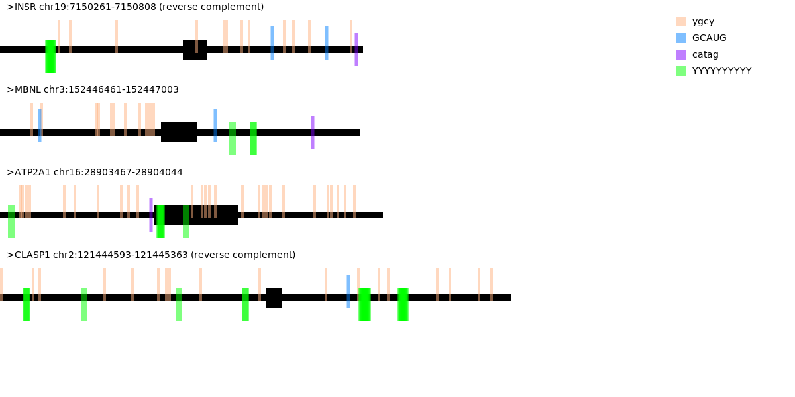

# Motif Marker
This project takes in a FASTA file of gene sequences along with a file of motifs to locate and returns an annotated image to visualize the motifs in the genes by using the pycairo library to illustrate.

## Requirements
You must have pycairo installed in your environment for it to work.
Gene file must be in FASTA format with a header then gene sequence for each gene.
Motifs must be in text file with one motif per line and specified with IUPAC codes per base.

## Notes
Exons in the file will be highlighted only if they are capitalized in the gene sequences.
Genes must be 1000 or less bp in length.
5 motifs can be located at a time as specified in the motif file.

## How to Run
```
mamba activate pycairo_env

# -f specifies the input fasta file
# -m specifies the input motif file

# example:
./motif-mark-oop.py -f your_FASTA_file -m your_motif_file
```

## Output
Returns an image (.png) with the same name as the original fasta file.



